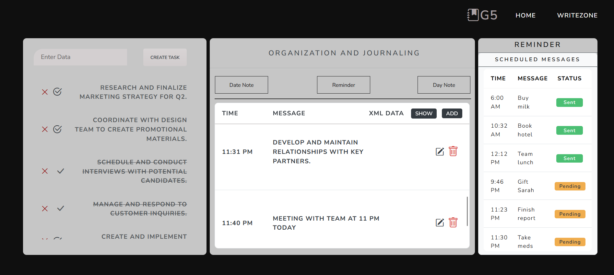

# Utility-Based-Reminder-System
The primary users of RemindMe+ are individuals who need an easy and reliable way to manage their daily tasks, appointments, and deadlines without the hassle of complicated tools.

# RemindMe+ - Smart Messaging Utility App

 <!-- Add your banner image -->

A responsive web-based reminder management system built with ASP.NET MVC (C#) featuring intelligent alert notifications and seamless task management.

## 🌟 Key Features
- 🎯 Create personalized reminders with custom messages
- ⏰ Set precise alert times with datetime picker
- ✏️ Edit existing reminders dynamically
- 🗑️ Delete reminders with confirmation
- 🔔 Popup notifications
- 📋 Interactive list view of all reminders
- 📊 Syncfusion UI components integration
- 🛠️ Entity Framework data management

## 🛠️ Technologies Used
- ASP.NET MVC Core
- C# .NET
- Entity Framework Core (Code-First)
- Syncfusion Controls
- Bootstrap 5
- SQL Server
- HTML5/CSS3
- JavaScript/jQuery
- Visual Studio 2022

## 📦 Installation & Setup

1. **Open in Visual Studio**
   - Launch `SmartMessage.sln` solution file

2. **Restore NuGet Packages**
     ```markdown
   Install-Package Syncfusion.EJ2.AspNet.Mvc5

   Install-Package Microsoft.EntityFrameworkCore

   Install-Package Microsoft.EntityFrameworkCore.SqlServer


## 🧭 User Workflow Guide

### 📅 Creating Reminders
1. **Initiate New Reminder**  
   Click ➕ "+ Add" button
   
   2. **Complete Form Fields**  
   ```markdown
   
   | Field         | Description                   | Example Value    |
   |---------------|----------------------------- -|------------------|
   | Time          | 24-hour time picker           |  20:03           |
   | Message       | (255 character limit)         | "Team Meeting"   |
   | Status        | Auto-set to "Pending"         | (Non-editable)   |

    Save Entry
    Click "Add" to store reminder

🔄 Reminder Lifecycle
Table Management:

    Time	Message	Status	     Actions
    8:03        Finish report	  ✏️ 🗑️
    7:37        Buy milk	          ✏️ 🗑️

    ✏️ Edit: Modify time/message (resets status to Pending)

    🗑️ Delete: Remove entry permanently

🔔 Notification Handling

Alert Behavior:

    Popup appears at scheduled time with:

- 📢 Message: "Finish report at 10:44 PM"
- ⏰ Original Time: 8:03 PM
- 🔄 Status: Now triggering

Interaction Flow:

    Notification Appears

    User Chooses:

        ⏰ Snooze (15min): Keeps status as Pending

        ✅ Dismiss: Updates status to Completed

        📋 Details: Opens reminder in web interface
💾 Data Persistence

Entries stored with status tracking:
   ```markdown
<ReminderRecord>
  <ID>RM-20240524-1324</ID>
  <TriggerTime>2024-05-24T20:03:00</TriggerTime>
  <Message>Finish report</Message>
  <Status>Pending</Status>
  <Created>2024-05-24T13:24:01</Created>
</ReminderRecord>

   Status Indicators

    🟢 Green:sent
    🟡 Yellow: Pending (unresolved)
